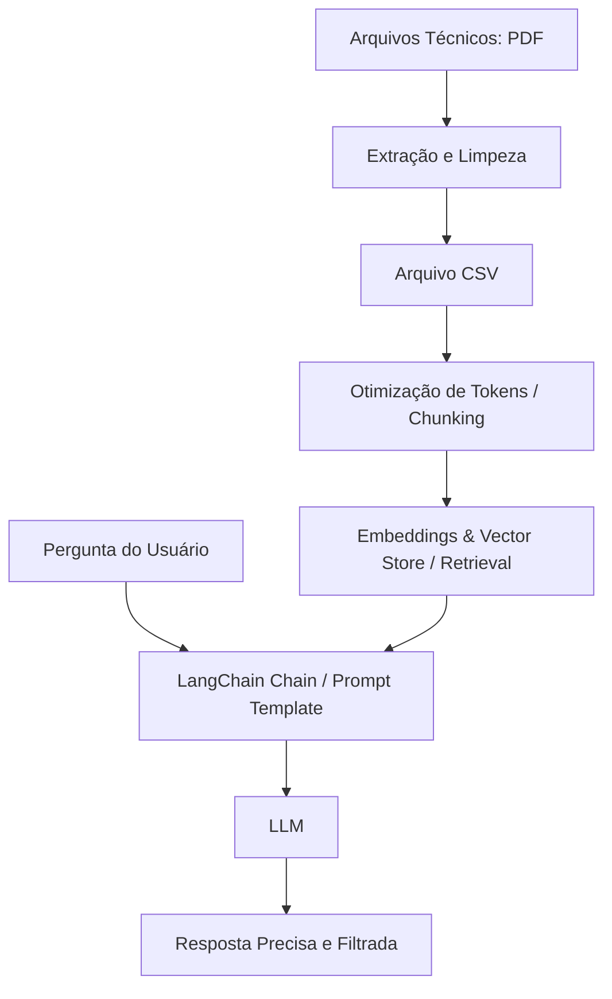

# 🤖 Guru dos Filtros - Chatbot de Extração de Dados Técnicos

Atividade acadêmica desenvolvido para a disciplina de programa integrador, o **Guru dos Filtros** é um chatbot inteligente desenvolvido para facilitar a consulta e a extração de especificações técnicas complexas contidas em catálogos de PDF e tabelas CSV.

Utilizando LLMs e o framework **LangChain**, o assistente converte dados brutos e estruturados de engenharia em respostas diretas, precisas e contextuais para o usuário final, otimizando o tempo de busca por compatibilidades e códigos de peças.

## 🚀 Funcionalidades Chave

- **Leitura Multiformato:** Ingestão dinâmica de arquivos CSV (tabelas de aplicação) e documentos PDF (manuais técnicos e informativos de engenharia).

- **Processamento e Otimização de Contexto:** Estratégia eficiente de divisão de texto (*chunking*) e tratamento de tokens para alimentar a LLM com as informações exatas, reduzindo custos e latência de API.

- **Recuperação Inteligente (RAG):** Arquitetura voltada para busca semântica, garantindo que o chatbot não alucine e responda estritamente baseado no banco de dados técnico fornecido.

- **Filtros Personalizados:** Capacidade de cruzar informações complexas (ex: "Qual filtro é compatível com o motor X do ano Y?").

## 🛠️ Tecnologias e Ferramentas

O projeto foi construído utilizando as melhores práticas de desenvolvimento de aplicações de Inteligência Artificial:

- **Linguagem:** [Python](https://www.python.org/)

- **Orquestração de LLM:** [LangChain](https://www.langchain.com/) (gerenciamento de prompts, memória e chains)

- **Variáveis de Ambiente:** `python-dotenv` para segurança de chaves de AP

## 📐 Como Funciona? (Arquitetura Simplificada)

## 👤 Autor

Desenvolvido por **\[Daniel Ângelo\]**.

*Conecte-se comigo no [LinkedIn](www.linkedin.com/in/daniel-angelo-software-engineer) ou explore mais do meu portfólio no [GitHub](https://github.com/DanielAngelo2024?tab=repositories).*

